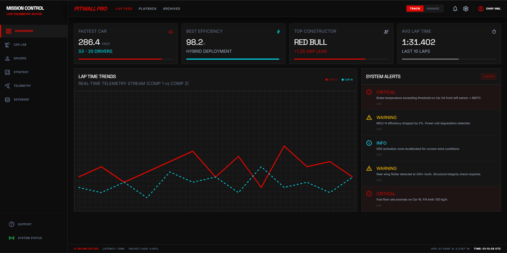
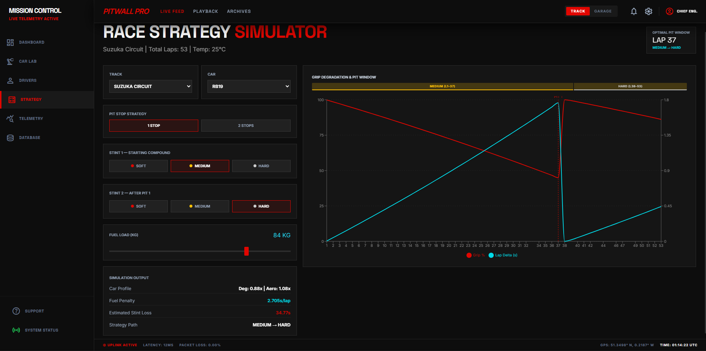
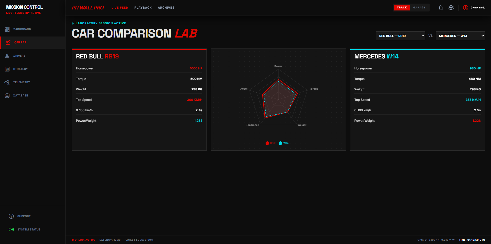
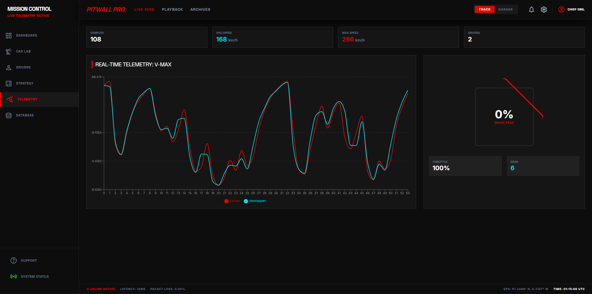
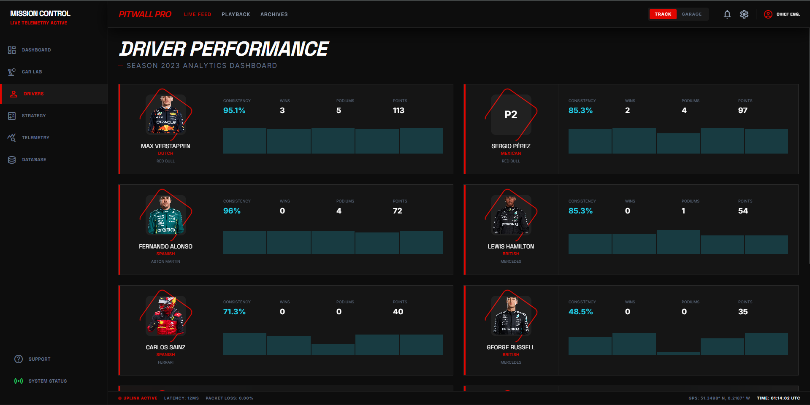

# Pitwall Pro

Pitwall Pro is a full-stack Formula 1 Mission Control application designed to simulate the data-rich environment of an F1 team's pitwall. It provides comprehensive analytics, live telemetry visualization, championship standings, car performance comparisons, and an advanced race strategy simulator based on real 2023 F1 data.



---

## Key Features

### 1. Advanced Race Strategy Simulator
A physics-inspired, data-driven strategy engine that optimizes tire stints and pit windows.
* **Car Performance Profiles**: Backed by real 2023 F1 data. The engine accounts for a car's unique tire degradation multiplier, downforce levels, base lap deltas, and fuel efficiency (e.g., the Red Bull RB19 is gentler on tires, while the Mercedes W14 struggles with degradation).
* **Multi-Stint Modeling**: Accurately simulates 1-stop and 2-stop strategies, resetting tire grip to 100% after each pit stop based on the chosen compound.
* **F1 Rule Validation**: Enforces the FIA sporting regulation that at least two distinct slick tire compounds must be used during a dry race. An instant UI warning highlights illegal strategies (e.g., `SOFT -> SOFT`).
* **Interactive Visualization**: Recharts-based grip degradation curves with color-coded compound stint bars and dynamic pit window markers.



### 2. Car Performance Lab
* Compare any two cars on the grid using a normalized **Radar Chart** across 5 dimensions: Horsepower, Torque, Weight, Top Speed, and Acceleration.
* Calculates dynamic metrics like Power-to-Weight ratio.



### 3. Live Telemetry Dashboard
* Visualizes lap-by-lap telemetry data including Speed, RPM, Throttle, Brake, and Gear usage.
* Displays critical alerts from the car sensors (e.g., Brake temperature warnings, DRS activation).



### 4. Championship Standings & Race Results
* Fetches and displays the current Drivers' and Constructors' championship standings.
* Granular breakdown of individual race results, including fastest laps and points awarded.



---

## Architecture & Tech Stack

### Frontend (React + Vite)
* **Framework**: React.js bootstrapped with Vite.
* **Styling**: Tailwind CSS (custom dark-mode, glassmorphism UI elements, F1-inspired typography).
* **Data Visualization**: Recharts for complex, responsive charts (Telemetry curves, Strategy degradation, Car Lab radar charts).
* **Routing**: React Router DOM.

### Backend (FastAPI + Python)
* **Framework**: FastAPI for high-performance, asynchronous REST APIs.
* **Database**: MySQL/MariaDB accessed via SQLAlchemy ORM.
* **Data Sources**: Pre-seeded with real 2023 F1 season data utilizing the Jolpica-F1 (Ergast) API.
* **Engines**: Custom Python classes (`StrategyEngine`, `CarAnalyzer`, `DriverAnalyzer`) handling complex mathematical modeling and heuristic optimizations.

---

## Project Structure

```text
PitwallPro/
├── backend/
│   ├── app/
│   │   ├── main.py              # FastAPI endpoints
│   │   ├── models.py            # SQLAlchemy database models
│   │   ├── database.py          # DB connection setup
│   │   ├── strategy_engine.py   # Core tire degradation & strategy logic
│   │   ├── car_analyzer.py      # Car comparison math & normalization
│   │   ├── driver_analyzer.py   # Driver performance computations
│   │   └── seed.py              # Database seeding script (Ergast API)
│   ├── requirements.txt         # Python dependencies
│   └── fix_db_cars.py           # Utility to link seeded cars to teams
│
├── frontend/
│   ├── public/                  # Static assets
│   ├── src/
│   │   ├── api.js               # Centralized fetch wrappers for FastAPI
│   │   ├── App.jsx              # Routing & Layout wrapper
│   │   ├── index.css            # Tailwind directives & custom CSS variables
│   │   ├── pages/               
│   │   │   ├── DashboardPage.jsx
│   │   │   ├── DriversPage.jsx
│   │   │   ├── ConstructorsPage.jsx
│   │   │   ├── RacesPage.jsx
│   │   │   ├── TelemetryPage.jsx
│   │   │   ├── CarLabPage.jsx
│   │   │   └── StrategyPage.jsx # Strategy simulator UI
│   ├── tailwind.config.js       # Custom F1 color palette & fonts
│   └── package.json             # Node dependencies
```

---

## Getting Started

### Prerequisites
* **Node.js** (v16+)
* **Python** (3.9+)
* **MySQL** or **MariaDB** server running locally.

### 1. Database Setup
Ensure your local MySQL instance is running on port **3307** (as configured in `backend/app/database.py`). You do not need to create the database manually; the initialization script will handle it.

### 2. Project Initialization (Seeding)
This project uses a unified initialization script to create the database, seed historical F1 data from the Ergast API, and cache telemetry data from FastF1.

Navigate to the `backend` directory and run:
```bash
cd backend
pip install -r requirements.txt
python -m app.init_project
```
*Note: The first run may take several minutes as it downloads telemetry cache files from FastF1.*

### 3. Running the Application

**Start Backend:**
```bash
cd backend
python -m uvicorn app.main:app --reload --port 8000
```

**Start Frontend:**
```bash
cd frontend
npm install
npm run dev
```

### 4. Access the App
Open your browser and navigate to `http://localhost:5173` to access the Pitwall Pro interface. The API documentation (Swagger) is available at `http://localhost:8000/docs`.

---

## Strategy Engine Deep Dive

The `StrategyEngine` (`backend/app/strategy_engine.py`) is the computational heart of the Strategy Page. 

1. **Base Degradation Model**: Each compound (SOFT, MEDIUM, HARD) has a base wear rate.
2. **Track Modifiers**: Track temperature and lap count alter the wear multiplier (e.g., Monza vs Silverstone).
3. **Car Modifiers**: The engine applies modifiers based on the selected car. The `tire_wear_mult` determines how aggressively the car eats its tires, while `downforce` adds a base grip bonus. `base_lap_delta` ensures lap time outputs reflect the true hierarchy of the 2023 grid.
4. **Heuristic Optimizer**: For a given number of stops, the engine calculates the intersection of optimal grip drop-off thresholds (e.g., pitting when grip drops below 45%) to minimize the `estimated_total_loss_s`.
5. **Multi-stint Curve Generation**: The engine slices the race into stints based on the pit laps, calculates degradation for the specific compound active in that stint, and resets grip at the boundary, generating the data required for the Recharts visualization.
